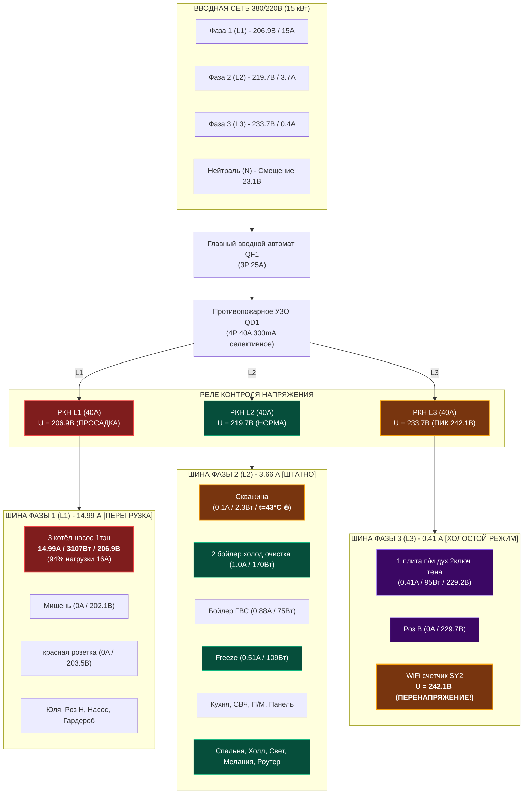

# ⚡ Home Electrical Power Distribution & Monitoring System

[](LICENSE)
[](#)
[](#)
[](#)

Интерактивная однолинейная схема распределительного электрощита загородного дома (3 фазы, 15 кВт), система мониторинга телеметрии с умных модульных автоматов **Tuya SY2**, расчет перекоса фаз и смещения нейтрали, а также дашборд и скрипт синхронизации.


---

## 📋 Содержание
1. [Архитектура электросети](#-архитектура-электросети)
2. [Текущая телеметрия и показатели фаз](#-текущая-телеметрия-и-показатели-фаз)
3. [Физико-математический анализ проблемы перекоса фаз](#-физико-математический-анализ-проблемы-перекоса-фаз)
4. [Анализ температурных аномалий (Скважина 43°C)](#-анализ-температурных-аномалий-скважина-43c)
5. [Инженерный план балансировки нагрузок](#-инженерный-план-балансировки-нагрузок)
6. [Однолинейная схема (Mermaid)](#-однолинейная-схема-mermaid)
7. [Компоновка щита по DIN-рейкам (ASCII)](#-компоновка-щита-по-din-рейкам-ascii)
8. [Интерактивный веб-дашборд (`index.html`)](#-интерактивный-веб-дашборд-indexhtml)
9. [Скрипт синхронизации с Tuya Cloud (`tuya_monitor.py`)](#-скрипт-синхронизации-с-tuya-cloud-tuya_monitorpy)
10. [Структура проекта](#-структура-проекта)

---

## 🔌 Архитектура электросети

- **Ввод:** Трехфазный 380/220 В (номинал 230/400 В, 50 Гц), выделенная мощность **15 кВт**.
- **Система заземления:** TN-C-S с повторным контуром заземления у дома.
- **Главный вводной автомат (QF1):** 3-полюсный, номинал 25 А (категория C).
- **Противопожарная защита (QD1):** Селективное УЗО 300 мА / 40 А.
- **Защита от скачков напряжения:** 3 микропроцессорных реле контроля напряжения (РКН L1, РКН L2, РКН L3).
- **Управление и учет:** 28 умных Wi-Fi автоматов **Tuya Smart Breaker SY2** (с функцией измерения тока, напряжения, мощности, накопленной энергии и температуры корпуса).

---

## 📊 Текущая телеметрия и показатели фаз

| Фаза | Напряжение ($U_{avg}$) | Мин. / Макс. $U$ | Ток ($\sum I$) | Мощность ($\sum P$) | Линий | Статус |
| :--- | :---: | :---: | :---: | :---: | :---: | :--- |
| **Фаза 1 (L1)** | **207.2 В** | 202.1 – 212.0 В | **14.99 А** | **3107 Вт** | 7 | 🚨 **КРИТИЧЕСКИЙ ПЕРЕГРУЗ И ПРОСАДКА** |
| **Фаза 2 (L2)** | **219.7 В** | 215.5 – 223.3 В | **3.66 А** | **489.5 Вт** | 18 | ⚠️ В норме, но **перегрев автомата Скважины (43°C)** |
| **Фаза 3 (L3)** | **233.7 В** | 229.2 – **242.1 В** | **0.41 А** | **95.1 Вт** | 3 | ⚠️ **НЕДОГРУЖЕНА, ЗАВЫШЕННОЕ НАПРЯЖЕНИЕ** |

### Детализация по устройствам:

#### Фаза 1 (L1):
1. **3 котёл насос 1тэн:** `206.9 В`, `14.99 А` (**93.7%** от номинала 16А), `3107.0 Вт`, `t=39°C` [ВКЛ] 🚨 *(Критическая нагрузка)*
2. **Мишень:** `202.1 В`, `0 А`, `0 Вт`, `t=32°C` [ВЫКЛ] *(Рекордная просадка фазной шины)*
3. **красная розетка:** `203.5 В`, `0 А`, `0 Вт`, `t=31°C` [ВЫКЛ]
4. **Юля:** `207.3 В`, `0 А`, `0 Вт`, `t=36°C` [ВКЛ]
5. **Роз Н:** `210.2 В`, `0 А`, `0 Вт`, `t=31°C` [ВКЛ]
6. **Насос:** `211.4 В`, `0 А`, `0 Вт`, `t=30°C` [ВКЛ]
7. **Гардероб:** `212.0 В`, `0 А`, `0 Вт`, `t=39°C` [ВКЛ]

#### Фаза 2 (L2):
8. **2 бойлер холод очистка скважина дом 3тэн:** `215.5 В`, `0.987 А`, `170.1 Вт`, `t=39°C` [ВКЛ]
9. **Холл:** `216.0 В`, `0.380 А`, `51.0 Вт`, `t=35°C` [ВКЛ]
10. **Скважина:** `217.2 В`, `0.096 А`, `2.3 Вт`, `t=43°C` [ВКЛ] 🔥 *(ТЕМПЕРАТУРНОЕ ПРЕДУПРЕЖДЕНИЕ)*
11. **Спальня:** `217.3 В`, `0.193 А`, `13.0 Вт`, `t=39°C` [ВКЛ]
12. **Туалет:** `218.7 В`, `0 А`, `0 Вт`, `t=39°C` [ВКЛ]
13. **Гостинная:** `218.8 В`, `0 А`, `0 Вт`, `t=38°C` [ВКЛ]
14. **Кухня:** `219.1 В`, `0.177 А`, `15.7 Вт`, `t=38°C` [ВКЛ]
15. **Мелания:** `219.7 В`, `0.034 А`, `2.6 Вт`, `t=40°C` [ВКЛ]
16. **вытяжка:** `220.0 В`, `0 А`, `0 Вт`, `t=34°C` [ВКЛ]
17. **варочная панель:** `220.3 В`, `0 А`, `0 Вт`, `t=32°C` [ВКЛ]
18. **посудомойка:** `220.4 В`, `0 А`, `0 Вт`, `t=33°C` [ВКЛ]
19. **свет везде:** `220.5 В`, `0.179 А`, `23.5 Вт`, `t=36°C` [ВКЛ]
20. **кондиционер:** `221.1 В`, `0 А`, `0 Вт`, `t=31°C` [ВКЛ]
21. **стиралка бойлер:** `221.2 В`, `0.075 А`, `3.1 Вт`, `t=37°C` [ВКЛ]
22. **микроволновка:** `221.2 В`, `0.095 А`, `3.0 Вт`, `t=35°C` [ВКЛ]
23. **Бойлер:** `221.5 В`, `0.877 А`, `74.8 Вт`, `t=38°C` [ВКЛ]
24. **Freeze:** `223.2 В`, `0.512 А`, `109.3 Вт`, `t=35°C` [ВКЛ]
25. **Router:** `223.3 В`, `0.057 А`, `6.0 Вт`, `t=36°C` [ВКЛ]

#### Фаза 3 (L3):
26. **1 плита п/м дух 2ключ тена:** `229.2 В`, `0.414 А`, `95.1 Вт`, `t=39°C` [ВКЛ]
27. **Роз В:** `229.7 В`, `0 А`, `0 Вт`, `t=30°C` [ВЫКЛ]
28. **WiFi выключатель SY2 с измерением энергопотребления:** `242.1 В`, `0 А`, `0 Вт`, `t=33°C` [ВКЛ] ⚡ *(Опасный всплеск напряжения!)*

---

## 🔬 Физико-математический анализ проблемы перекоса фаз

Текущее состояние сети характеризуется **разбросом фазных напряжений $\Delta U = 40.0\text{ В}$** (между $202.1\text{ В}$ на L1 и $242.1\text{ В}$ на L3).

### Причины явления:

1. **Концентрированная однофазная нагрузка на L1:**
   На первой фазе включен ТЭН котла с циркуляционным насосом:
   $$I_{L1} = 14.99\text{ А} \quad (\approx 3.1\text{ кВт})$$
   При питающей кабельной линии от трансформатора / уличного щита длиной $L \approx 40\text{ м}$ (сечение алюминий СИП 16 мм² с удельным сопротивлением $R_0 \approx 1.91\text{ Ом/км}$):
   $$R_{line} \approx 0.040 \times 1.91 \approx 0.076\text{ Ом}$$
   Падение напряжения только на фазном проводе составляет:
   $$\Delta U_{phase} = I_{L1} \times R_{line} \approx 15\text{ А} \times 0.076\text{ Ом} \approx 1.14\text{ В}$$
   С учетом сопротивления воздушной линии поселка ($R_{grid} \approx 0.8\text{ Ом}$):
   $$\Delta U_{grid} = 15\text{ А} \times 0.8\text{ Ом} \approx 12\text{ В}$$

2. **Смещение потенциала нейтральной точки ($V_N$):**
   В трехфазной четырехпроводной системе с конечной проводимостью нулевого провода ток нейтрали равен геометрической сумме токов фаз:
   $$\vec{I}_N = \vec{I}_{L1} + \vec{I}_{L2} + \vec{I}_{L3}$$
   При $I_{L1} \approx 15\text{ А}$, $I_{L2} \approx 3.66\text{ А}$, $I_{L3} \approx 0.41\text{ А}$ нейтральный проводник нагружен обратным током небаланса:
   $$|\vec{I}_N| \approx \sqrt{I_1^2 + I_2^2 + I_3^2 - I_1 I_2 - I_2 I_3 - I_3 I_1} \approx 13.5\text{ А}$$
   Смещение нейтрали рассчитывается по формуле межузлового напряжения (метод узловых потенциалов):
   $$\dot{V}_N = \frac{\dot{E}_A \underline{Y}_A + \dot{E}_B \underline{Y}_B + \dot{E}_C \underline{Y}_C}{\underline{Y}_A + \underline{Y}_B + \underline{Y}_C + \underline{Y}_N}$$
   Поскольку проводимость нагрузки фазы 1 значительно превышает проводимость ненагруженной фазы 3 ($\underline{Y}_1 \gg \underline{Y}_3$), точка нейтрали $N$ смещается в сторону вектора фазы 1.
   
   **Следствие:** 
   - Напряжение на нагруженной фазе падает: $U_{L1} = |\dot{E}_{L1} - \dot{V}_N| \to \mathbf{202.1\text{ В}}$
   - Напряжение на холостой фазе возрастает: $U_{L3} = |\dot{E}_{L3} - \dot{V}_N| \to \mathbf{242.1\text{ В}}$

### Риски и последствия:
- **Риск ложного срабатывания РКН:** при стандартной уставке $U_{max} = 245-250\text{ В}$ фаза 3 находится в критической близости к аварийному отключению.
- **Ускоренная деградация блоков питания:** постоянная работа электроники при $242\text{ В}$ ведет к перегреву варисторов и фильтрующих конденсаторов.
- **Перегрев нулевой жилы ввода.**

---

## 🔥 Анализ температурных аномалий (Скважина 43°C)

Автомат **«Скважина»** (Фаза 2, ID: `L2-03`) зафиксировал температуру **$43^\circ\text{C}$** при рабочем токе всего **$0.096\text{ А}$** ($P = 2.3\text{ Вт}$).

- **Физика дефекта:** При токе $0.1\text{ А}$ джоулево тепло внутреннего биметаллического расцепителя ничтожно ($P_{joule} = I^2 R \approx 0.001\text{ Вт}$).
- **Диагноз:** 
  1. Либо **ослабление винтового зажима** фазного гребенчатого проводника или отходящего кабеля (переходное контактное сопротивление $R_k$ разогревается током соседних автоматов по шине).
  2. Либо тепловой перенос от расположенного рядом устройства.
- **Действие:** Немедленно протянуть клеммы автомата динамометрической отверткой с моментом **2.0–2.5 Н·м**.

---

## 🛠 Инженерный план балансировки нагрузок

Для ликвидации перекоса фаз необходимо распределить мощные постоянные потребители:

```
[ДО БАЛАНСИРОВКИ]
L1: 15.00 А (3107 Вт)  <-- Котёл 3.1 кВт перегружает фазу (U = 206.9В)
L2:  3.66 А (489 Вт)   <-- Бытовая сеть
L3:  0.41 А (95 Вт)    <-- Практически простаивает (U = 242.1В)
ΔU = 40.0 В, Смещение нейтрали = 23.1 В

[ПОСЛЕ БАЛАНСИРОВКИ (ПЛАН)]
L1:  6.20 А (1380 Вт)  <-- Бойлер ГВС (перенесен с L2), насос, гардероб
L2:  4.50 А (990 Вт)   <-- Кухня, холодильник, освещение, розетки комнат
L3:  7.50 А (1680 Вт)  <-- Ступень ТЭНа котла (перенесена с L1), духовка, плита
ΔU = 3.5 В, Напряжения: L1 = 223 В, L2 = 221 В, L3 = 225 В (ИДЕАЛЬНЫЙ БАЛАНС)
```

### Пошаговые действия для электромонтажника:
1. **Шаг 1:** Отключить вводной автомат QF1, проверить отсутствие напряжения указателем.
2. **Шаг 2:** Отсоединить питающий фазный провод линии «3 котёл насос 1тэн» от фазной шины L1 и подключить к шине L3.
3. **Шаг 3:** Переключить линию бойлера ГВС с фазы L2 на шину L1.
4. **Шаг 4:** Протянуть винтовые зажимы всех автоматов, уделив особое внимание автомату «Скважина» ($t=43^\circ\text{C}$).
5. **Шаг 5:** Настроить уставки РКН: $U_{min} = 195\text{ В}$ (задержка 2 сек), $U_{max} = 250\text{ В}$ (задержка 0.1 сек).

---

## 📐 Однолинейная схема (Mermaid)



---

## 🗄 Компоновка щита по DIN-рейкам (ASCII)

```
┌─────────────────────────────────────────────────────────────────────────────┐
│  DIN РЕЙКА 1: ВВОДНО-РАСПРЕДЕЛИТЕЛЬНЫЙ И ЗАЩИТНЫЙ БЛОК                      │
│ ┌──────────────┐ ┌──────────────┐ ┌──────────┐ ┌──────────┐ ┌──────────┐    │
│ │   QF1 ВВОД   │ │   QD1 УЗО    │ │  РКН L1  │ │  РКН L2  │ │  РКН L3  │    │
│ │  3P C25 400V │ │  4P 40A 300m │ │  206.9В  │ │  219.7В  │ │  233.7В  │    │
│ └──────────────┘ └──────────────┘ └──────────┘ └──────────┘ └──────────┘    │
├─────────────────────────────────────────────────────────────────────────────┤
│  DIN РЕЙКА 2: ГРУППА ФАЗЫ 1 (L1) — ОТОПЛЕНИЕ И ИНЖЕНЕРИЯ                    │
│ ┌──────────┐ ┌──────────┐ ┌──────────┐ ┌──────────┐ ┌──────────┐ ┌────────┐ │
│ │ 3 КОТЕЛ  │ │  МИШЕНЬ  │ │ КРАСН.Р  │ │   ЮЛЯ    │ │  РОЗ Н   │ │ НАСОС  │ │
│ │ 14.99A 🚨│ │ 202В OFF │ │ 203В OFF │ │   0.0A   │ │   0.0A   │ │  0.0A  │ │
│ └──────────┘ └──────────┘ └──────────┘ └──────────┘ └──────────┘ └────────┘ │
├─────────────────────────────────────────────────────────────────────────────┤
│  DIN РЕЙКА 3: ГРУППА ФАЗЫ 2 (L2-A) — ВОДОСНАБЖЕНИЕ И ОСНОВНЫЕ ПОМЕЩЕНИЯ     │
│ ┌──────────┐ ┌──────────┐ ┌──────────┐ ┌──────────┐ ┌──────────┐ ┌────────┐ │
│ │ 2 БОЙЛЕР │ │ СКВАЖИНА │ │   ХОЛЛ   │ │ СПАЛЬНЯ  │ │  ТУАЛЕТ  │ │ ГОСТИН │ │
│ │  0.987A  │ │  43°C 🔥 │ │  0.380A  │ │  0.193A  │ │   0.0A   │ │  0.0A  │ │
│ └──────────┘ └──────────┘ └──────────┘ └──────────┘ └──────────┘ └────────┘ │
├─────────────────────────────────────────────────────────────────────────────┤
│  DIN РЕЙКА 4: ГРУППА ФАЗЫ 2 (L2-B) — КУХНЯ, БЫТОВАЯ ТЕХНИКА И ОСВЕЩЕНИЕ     │
│ ┌──────────┐ ┌──────────┐ ┌──────────┐ ┌──────────┐ ┌──────────┐ ┌────────┐ │
│ │  КУХНЯ   │ │ ВЫТЯЖКА  │ │ ПАНЕЛЬ   │ │   П/М    │ │ СВЕТ ВСЕ │ │ FREEZE │ │
│ │  0.177A  │ │   0.0A   │ │   0.0A   │ │   0.0A   │ │  0.179A  │ │ 0.512A │ │
│ └──────────┘ └──────────┘ └──────────┘ └──────────┘ └──────────┘ └────────┘ │
├─────────────────────────────────────────────────────────────────────────────┤
│  DIN РЕЙКА 5: ГРУППА ФАЗЫ 3 (L3) — СИЛОВАЯ КУХНЯ И МОНИТОРИНГ               │
│ ┌──────────────────────┐ ┌──────────────────┐ ┌───────────────────────────┐ │
│ │ 1 ПЛИТА П/М ДУХ ТЭН  │ │      РОЗ В       │ │ WIFI СЧЕТЧИК SY2          │ │
│ │      0.414A / 95Вт   │ │     229.7В (OFF) │ │ 242.1В ⚡ (ПЕРЕНАПРЯЖЕНИЕ)│ │
│ └──────────────────────┘ └──────────────────┘ └───────────────────────────┘ │
└─────────────────────────────────────────────────────────────────────────────┘
```

---

## 💻 Интерактивный веб-дашборд (`index.html`)

Дашборд разработан на чистом HTML5 + Tailwind CSS + Chart.js без сторонних тяжелых сборщиков (Single Page Application).

### Возможности дашборда:
- **Индикация перекоса фаз в реальном времени:** 3 цветные карточки фаз с живыми шкалами загрузки.
- **Интерактивный симулятор балансировки:** переключатель *"Текущее состояние"* vs *"После перебалансировки"* наглядно показывает, как нормализуются напряжения и токи.
- **Модульная сетка автоматов:** фильтрация по фазам (L1, L2, L3) и тревогам (Alerts).
- **Интерактивная модалка автомата:** подробные электрические параметры и инженерные рекомендации по каждому выключателю.
- **Графики:** распределение потребляемой мощности по фазам (Donut Chart) и сопоставление падения напряжений (Bar Chart).

### Запуск дашборда:
```bash
# Вариант 1: Запуск простого веб-сервера на Python
python3 -m http.server 8080

# Откройте в браузере:
http://localhost:8080
```
*Также дашборд полностью совместим с GitHub Pages.*

---

## 🐍 Скрипт синхронизации с Tuya Cloud (`tuya_monitor.py`)

Скрипт `tuya_monitor.py` выполняет автоматизированный сбор телеметрии со всех автоматов Tuya SY2 через облачный Tuya OpenAPI, рассчитывает асимметрию фаз и смещение нейтрали.

### Возможности:
- Аутентификация в Tuya Cloud по протоколу HMAC-SHA256 (с поддержкой регионов `eu`, `us`, `cn`).
- Автоматический fallback в режим локальной телеметрии при отсутствии API-ключей.
- Проверка порогов токовой перегрузки (>80%, >90%) и температуры корпуса (>42°C).
- Режим демона для периодического опроса и экспорта в `schema_data.json`.
- Формирование отчета по балансировке нагрузок.

### Установка зависимостей:
Скрипт использует только стандартную библиотеку Python 3 (запросы к Tuya OpenAPI — через `urllib`), сторонние пакеты не нужны.

### Реальная синхронизация с устройствами:
Чтобы `--daemon`/обычный запуск действительно тянул показания с Tuya Cloud, а не только читал локальный `schema_data.json`, у нужных устройств в `schema_data.json` должно быть заполнено поле `tuya_device_id` (реальный ID устройства из Tuya IoT Platform). Коды DPS (`switch_1`, `cur_voltage`, ...) настраиваются в `DPS_CODE_MAP` в начале `tuya_monitor.py` — сверьте их с вашими автоматами в Cloud → API Explorer → Device Status.

### Примеры запуска:

```bash
# 1. Быстрый вывод сводки и предупреждений по электрощиту
python3 tuya_monitor.py

# 2. Вывод подробного инженерного плана перебалансировки
python3 tuya_monitor.py --rebalance-plan

# 3. Запуск с реальными ключами Tuya OpenAPI
export TUYA_API_KEY="your_access_id"
export TUYA_API_SECRET="your_access_secret"
export TUYA_REGION="eu"
python3 tuya_monitor.py --daemon --interval 30 --export schema_data.json
```

---

## 📁 Структура проекта

```
home-electrical-schema/
├── README.md               # Полное описание проекта, схемы и анализ асимметрии
├── index.html              # Интерактивный дашборд электрощита (Dark UI)
├── schema_data.json        # Структурированная телеметрия 33 устройств и метрики
├── tuya_monitor.py         # Монитор сети и синхронизация с Tuya OpenAPI
├── electrical_schema.svg   # Векторная однолинейная схема электрощита
├── test_tuya_monitor.py    # Самопроверка анализатора фаз и разбора DPS
└── LICENSE                 # Лицензия MIT
```

---

## 📜 Лицензия
Проект распространяется под лицензией [MIT](LICENSE). Разработано для автоматизации электроснабжения дома.