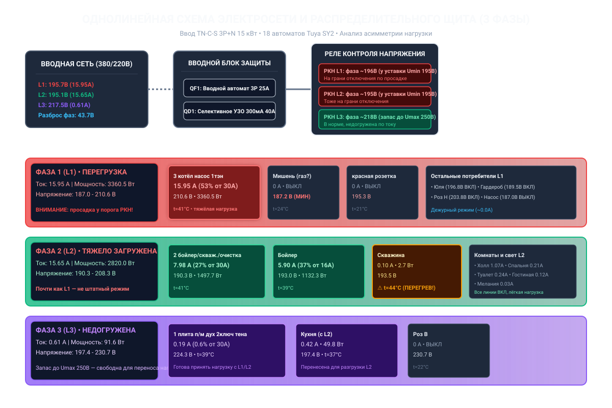
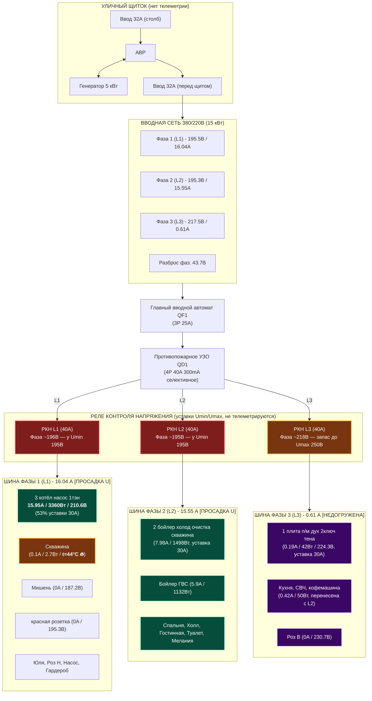

# ⚡ Home Electrical Power Distribution & Monitoring System

[](LICENSE)
[](#)
[](#)
[](#)

Интерактивная однолинейная схема распределительного электрощита загородного дома (3 фазы, 15 кВт), система мониторинга телеметрии с умных модульных автоматов **Tuya SY2**, расчет перекоса фаз и смещения нейтрали, а также дашборд и скрипт синхронизации.



---

## 📋 Содержание
1. [Архитектура электросети](#-архитектура-электросети)
2. [Текущая телеметрия и показатели фаз](#-текущая-телеметрия-и-показатели-фаз)
3. [Физико-математический анализ проблемы перекоса фаз](#-физико-математический-анализ-проблемы-перекоса-фаз)
4. [Анализ температурных аномалий (Скважина 44°C)](#-анализ-температурных-аномалий-скважина-44c)
5. [Инженерный план балансировки нагрузок](#-инженерный-план-балансировки-нагрузок)
6. [Однолинейная схема (Mermaid)](#-однолинейная-схема-mermaid)
7. [Компоновка щита по DIN-рейкам (ASCII)](#-компоновка-щита-по-din-рейкам-ascii)
8. [Интерактивный веб-дашборд (`index.html`)](#-интерактивный-веб-дашборд-indexhtml)
9. [Скрипт синхронизации с Tuya Cloud (`tuya_monitor.py`)](#-скрипт-синхронизации-с-tuya-cloud-tuya_monitorpy)
10. [Структура проекта](#-структура-проекта)

---

## 🔌 Архитектура электросети

- **Ввод:** Трехфазный 380/220 В (номинал 230/400 В, 50 Гц), выделенная мощность **15 кВт**.
- **Уличный щиток (до умных автоматов):** 2 обычных (не Tuya) автомата 3P 32А. В разрыве между ними —
  АВР и резервный генератор 5 кВт: при пропадании сети АВР переключает нагрузку на генератор.
  Второй автомат уже без телеметрии передаёт фазы на главный вводной QF1.
- **Система заземления:** TN-C-S с повторным контуром заземления у дома.
- **Главный вводной автомат (QF1):** 3-полюсный, номинал 25 А (категория C).
- **Противопожарная защита (QD1):** Селективное УЗО 300 мА / 40 А.
- **Защита от скачков напряжения:** 3 микропроцессорных реле контроля напряжения (РКН L1, РКН L2, РКН L3).
- **Управление и учет:** 18 умных Wi-Fi автоматов **Tuya Smart Breaker SY2** (измерение тока, напряжения, мощности, накопленной энергии и температуры корпуса).
- **Уставки защиты автоматов** читаются с самих устройств (raw-DPS `alarm_set_1` / `alarm_set_2`), а не задаются в файле: силовые линии (котёл, бойлер/скважина, плита) выставлены на **30 А**, остальные линии — на **16 А**; перегрев 70 / 65 °C, окно напряжения 175–255 / 180–250 В.

---

## 📊 Текущая телеметрия и показатели фаз

| Фаза | Напряжение ($U_{avg}$) | Мин. / Макс. $U$ | Ток ($\sum I$) | Мощность ($\sum P$) | Линий | Статус |
| :--- | :---: | :---: | :---: | :---: | :---: | :--- |
| **Фаза 1 (L1)** | **195.5 В** | 187.0 – 210.6 В | **16.04 А** | **3363.2 Вт** | 9 | ⚠️ **НАПРЯЖЕНИЕ ВНЕ НОРМЫ** |
| **Фаза 2 (L2)** | **195.3 В** | 190.3 – 208.3 В | **15.55 А** | **2817.3 Вт** | 8 | ⚠️ **НАПРЯЖЕНИЕ ВНЕ НОРМЫ** |
| **Фаза 3 (L3)** | **217.5 В** | 197.4 – 230.7 В | **0.61 А** | **91.6 Вт** | 4 | ⚠️ **НЕДОГРУЖЕНА** |

### Детализация по устройствам:

#### Фаза 1 (L1):
1. **3 котёл насос 1тэн:** `210.6 В`, `15.95 А`, `3360.5 Вт`, `t=41°C` [ON] 🚨 *(критическая нагрузка)*
2. **Мишень:** `187.2 В`, `0.00 А`, `0.0 Вт`, `t=24°C` [OFF] ⚠️
3. **красная розетка:** `195.3 В`, `0.00 А`, `0.0 Вт`, `t=21°C` [OFF]
4. **Юля:** `196.8 В`, `0.00 А`, `0.0 Вт`, `t=36°C` [ON]
5. **Роз Н:** `203.8 В`, `0.00 А`, `0.0 Вт`, `t=24°C` [ON]
6. **Насос:** `187.0 В`, `0.00 А`, `0.0 Вт`, `t=20°C` [OFF]
7. **Гардероб:** `189.5 В`, `0.00 А`, `0.0 Вт`, `t=38°C` [ON]
8. **Скважина:** `193.5 В`, `0.10 А`, `2.7 Вт`, `t=44°C` [ON] 🔥 *(перегрев 44°C)*

#### Фаза 2 (L2):
9. **2 бойлер холод очистка скважина дом 3тэн:** `190.3 В`, `7.98 А`, `1497.7 Вт`, `t=41°C` [ON]
10. **Холл:** `208.3 В`, `1.07 А`, `145.2 Вт`, `t=36°C` [ON]
11. **Спальня:** `192.6 В`, `0.21 А`, `13.6 Вт`, `t=38°C` [ON]
12. **Туалет:** `192.7 В`, `0.24 А`, `10.9 Вт`, `t=38°C` [ON]
13. **Гостинная:** `197.6 В`, `0.12 А`, `15.1 Вт`, `t=37°C` [ON]
14. **Мелания:** `192.7 В`, `0.03 А`, `2.5 Вт`, `t=39°C` [ON]
15. **Бойлер:** `193.0 В`, `5.90 А`, `1132.3 Вт`, `t=39°C` [ON]

#### Фаза 3 (L3):
16. **1 плита п/м дух 2ключ тена:** `224.3 В`, `0.19 А`, `41.8 Вт`, `t=39°C` [ON]
17. **Роз В:** `230.7 В`, `0.00 А`, `0.0 Вт`, `t=22°C` [OFF]
18. **Кухня:** `197.4 В`, `0.42 А`, `49.8 Вт`, `t=37°C` [ON]

> В проекте учтены только 18 реальных автоматов SY2 этого дома. Устройства из других Tuya-проектов на том же аккаунте (другой дом/А2, свет-выключатели «Дивный» и т.п.) в схему и подсчёты не входят. Автомат «Скважина» перенесён с L2 на L1 — физически одна линия с «Мишень»/«красная розетка»/«Насос» (подтверждено).

---

## 🔬 Физико-математический анализ проблемы перекоса фаз

Текущее состояние сети характеризуется **разбросом фазных напряжений $\Delta U = 43.7\text{ В}$** (между $187.0\text{ В}$ на L1 и $230.7\text{ В}$ на L3, по реальным замерам автоматов — без учёта статичных показаний РКН-реле, см. ниже).

> ⚠️ Более ранняя версия этого раздела называла источником перекоса «перегруз L1 при простое L3» и утверждала напряжение до $242.1\text{ В}$ на L3. Это была ошибка: число $242.1\text{ В}$ бралось из поля `voltage_v` реле РКН L3, которое не телеметрируется Tuya и хранило статичный снимок — не реальный замер. Реальный максимум по фазе L3 (по автоматам с телеметрией) — $230.7\text{ В}$, с запасом $\approx 19\text{ В}$ до уставки $U_{max}=250\text{ В}$. Ниже — пересчёт на реальных данных.

### Причины явления:

1. **Две фазы нагружены почти поровну, третья простаивает:**
   $$I_{L1} \approx 16.04\text{ А} \ (\approx 3.36\text{ кВт, котёл+скважина}), \quad I_{L2} \approx 15.55\text{ А} \ (\approx 2.82\text{ кВт, бойлер}), \quad I_{L3} \approx 0.61\text{ А} \ (\approx 0.09\text{ кВт})$$
   Это не «L1 перегружена, остальные в норме» — L1 и L2 несут практически одинаковый ток, и именно их совместная нагрузка против простаивающей L3 и даёт разброс.

   Падение напряжения на фазном проводе от такого тока — вклад небольшой. При кабеле от уличного щита длиной $L \approx 40\text{ м}$ (алюминий СИП 16 мм², $R_0 \approx 1.91\text{ Ом/км}$):
   $$R_{line} \approx 0.040 \times 1.91 \approx 0.076\text{ Ом}, \qquad \Delta U_{phase} \approx 16.04\text{ А} \times 0.076\text{ Ом} \approx 1.2\text{ В}$$
   С учётом сопротивления воздушной линии поселка ($R_{grid} \approx 0.8\text{ Ом}$):
   $$\Delta U_{grid} \approx 16.04\text{ А} \times 0.8\text{ Ом} \approx 12.8\text{ В}$$
   Это на порядок меньше измеренного разброса $43.7\text{ В}$ — одного лишь омического падения в проводе не хватает, основной вклад даёт смещение нейтрали (ниже).

2. **Смещение потенциала нейтральной точки ($V_N$):**
   В трёхфазной четырёхпроводной системе с конечной проводимостью нулевого провода ток нейтрали равен геометрической сумме токов фаз:
   $$\vec{I}_N = \vec{I}_{L1} + \vec{I}_{L2} + \vec{I}_{L3}$$
   При $I_{L1} \approx 16.04\text{ А}$, $I_{L2} \approx 15.55\text{ А}$, $I_{L3} \approx 0.61\text{ А}$ модуль тока небаланса в нейтрали (при симметричном 120°-сдвиге фаз):
   $$|\vec{I}_N| \approx \sqrt{I_1^2 + I_2^2 + I_3^2 - I_1 I_2 - I_2 I_3 - I_3 I_1} \approx 15.2\text{ А}$$
   То есть через нулевой провод течёт почти такой же ток, как по нагруженной фазе — у TN-C-S это и смещает точку нейтрали $N$ в сторону вектора L1/L2, против простаивающей L3:
   $$\dot{V}_N = \frac{\dot{E}_A \underline{Y}_A + \dot{E}_B \underline{Y}_B + \dot{E}_C \underline{Y}_C}{\underline{Y}_A + \underline{Y}_B + \underline{Y}_C + \underline{Y}_N}, \qquad \underline{Y}_1 \approx \underline{Y}_2 \gg \underline{Y}_3$$

   **Измеренное следствие** (а не теоретический вывод формулы — admittance-ы реальной сети не промерены):
   - Напряжение на нагруженных фазах просело: $U_{L1} \approx 195.5\text{ В}$ (мин. $187.0\text{ В}$), $U_{L2} \approx 195.3\text{ В}$ (мин. $190.3\text{ В}$)
   - Напряжение на холостой фазе выросло, но умеренно: $U_{L3} \approx 217.5\text{ В}$ (макс. $230.7\text{ В}$) — не критично

### Риски и последствия:
- **Риск ложного срабатывания РКН по просадке, не по перенапряжению:** РКН L1 и РКН L2 обе работают в $\approx 0.1-0.7\text{ В}$ от уставки $U_{min}=195\text{ В}$ — при любом дополнительном включении на любой из этих фаз реле может отключить линию. РКН L3 — не в зоне риска (запас $\approx 19\text{ В}$ до $U_{max}=250\text{ В}$).
- **Перегрев нулевой жилы ввода:** ток нейтрали $\approx 15\text{ А}$ сопоставим с фазным — жила N рассчитана на такой же ток, но грелась бы сильнее при плохом контакте на вводной клемме.
- **Деградация электроники при длительной просадке** на L1/L2 (не перенапряжение на L3, как считалось раньше) — просадка хуже переносится импульсными БП, чем небольшое завышение.

---

## 🔥 Анализ температурных аномалий (Скважина 44°C)

Автомат **«Скважина»** (Фаза 1, ID: `L1-08`) зафиксировал температуру **$44^\circ\text{C}$** при рабочем токе всего **$0.096\text{ А}$** ($P = 2.7\text{ Вт}$).

- **Физика дефекта:** При токе $0.1\text{ А}$ джоулево тепло внутреннего биметаллического расцепителя ничтожно ($P_{joule} = I^2 R \approx 0.001\text{ Вт}$).
- **Диагноз:** 
  1. Либо **ослабление винтового зажима** фазного гребенчатого проводника или отходящего кабеля (переходное контактное сопротивление $R_k$ разогревается током соседних автоматов по шине).
  2. Либо тепловой перенос от расположенного рядом устройства.
- **Действие:** Немедленно протянуть клеммы автомата динамометрической отверткой с моментом **2.0–2.5 Н·м**.

---

## 🛠 Инженерный план балансировки нагрузок

Единственная крупная нагрузка на L1 — котёл + скважина (16.04А на фазе, из них 15.95А — сам котёл
на отдельной силовой линии), перенести только его «долю» без переразводки проводки нельзя.
Реалистичный план — перенести одну силовую линию с L2 на L3, это не даст идеальный баланс, но снимет
обе фазы (L1 и L2) с грани уставки РКН:

```
[ТЕКУЩЕЕ СОСТОЯНИЕ]
L1: 16.04 А (3363 Вт)  <-- Котёл + Скважина (U ≈ 195.5В — у уставки РКН Umin 195В)
L2: 15.55 А (2817 Вт)  <-- Бойлер (L2-01, 7.98А) + Бойлер (L2-16, 5.9А) + комнаты (U ≈ 195.3В — тоже у уставки)
L3:  0.61 А (92 Вт)    <-- Плита, кухня, Роз В — почти простой (U ≈ 217.5В)
Разброс напряжений: 43.7 В, ток небаланса в нейтрали ≈ 15.2 А

[ПЛАН: «2 бойлер холод очистка скважина» (L2-01, 7.98А) переносится с L2 на L3]
L1: 16.04 А (3363 Вт)  <-- без изменений
L2:  7.57 А (1320 Вт)  <-- комнаты + Бойлер (L2-16)
L3:  8.59 А (1589 Вт)  <-- Плита, кухня, Роз В + перенесённая линия
Разброс напряжений: ≈ 12.4 В (оценка по наблюдаемой U(I), не точный расчёт) — риск отключения РКН L2 снят,
L1 остаётся тяжело загруженной (это предел без переразводки проводки котла)
```

### Пошаговые действия для электромонтажника:
1. **Шаг 1:** Отключить вводной автомат QF1, проверить отсутствие напряжения указателем.
2. **Шаг 2:** Отсоединить питающий фазный провод линии «2 бойлер холод очистка скважина» от шины L2 и подключить к шине L3.
3. **Шаг 3:** Проверить после включения реальные токи и напряжения по фазам — числа выше оценочные, не гарантированные.
4. **Шаг 4:** Протянуть винтовые зажимы всех автоматов, уделив особое внимание автомату «Скважина» ($t=44^\circ\text{C}$).
5. **Шаг 5:** Настроить уставки РКН: $U_{min} = 195\text{ В}$ (задержка 2 сек), $U_{max} = 250\text{ В}$ (задержка 0.1 сек).

---

## 📐 Однолинейная схема (Mermaid)


```mermaid
flowchart TD
    subgraph STREET ["УЛИЧНЫЙ ЩИТОК (нет телеметрии)"]
        SIN1["Ввод 32А (столб)"]
        ATS["АВР"]
        GEN["Генератор 5 кВт"]
        SIN2["Ввод 32А (перед щитом)"]
        SIN1 --> ATS
        ATS <--> GEN
        ATS --> SIN2
    end

    subgraph GRID ["ВВОДНАЯ СЕТЬ 380/220В (15 кВт)"]
        IN_L1["Фаза 1 (L1) - 195.5В / 16.04А"]
        IN_L2["Фаза 2 (L2) - 195.3В / 15.55А"]
        IN_L3["Фаза 3 (L3) - 217.5В / 0.61А"]
        IN_N["Разброс фаз: 43.7В"]
    end

    SIN2 --> GRID

    QF1["Главный вводной автомат QF1<br/>(3P 25A)"]
    QD1["Противопожарное УЗО QD1<br/>(4P 40A 300mA селективное)"]

    GRID --> QF1 --> QD1

    subgraph V_RELAYS ["РЕЛЕ КОНТРОЛЯ НАПРЯЖЕНИЯ (уставки Umin/Umax, не телеметрируются)"]
        RKN1["РКН L1 (40A)<br/>Фаза ~196В — у Umin 195В"]
        RKN2["РКН L2 (40A)<br/>Фаза ~195В — у Umin 195В"]
        RKN3["РКН L3 (40A)<br/>Фаза ~218В — запас до Umax 250В"]
    end

    QD1 -->|L1| RKN1
    QD1 -->|L2| RKN2
    QD1 -->|L3| RKN3

    subgraph BUS_L1 ["ШИНА ФАЗЫ 1 (L1) - 16.04 А [ПРОСАДКА U]"]
        L1_KOTEL["3 котёл насос 1тэн<br/><b>15.95A / 3360Вт / 210.6В</b><br/>(53% уставки 30А)"]
        L1_SKV["Скважина<br/>(0.1A / 2.7Вт / <b>t=44°C 🔥</b>)"]
        L1_MISH["Мишень (0A / 187.2В)"]
        L1_KROZ["красная розетка (0A / 195.3В)"]
        L1_REST["Юля, Роз Н, Насос, Гардероб"]
    end

    subgraph BUS_L2 ["ШИНА ФАЗЫ 2 (L2) - 15.55 А [ПРОСАДКА U]"]
        L2_BOIL["2 бойлер холод очистка скважина<br/>(7.98A / 1498Вт, уставка 30А)"]
        L2_BOIL2["Бойлер ГВС (5.9A / 1132Вт)"]
        L2_ROOMS["Спальня, Холл, Гостинная, Туалет, Мелания"]
    end

    subgraph BUS_L3 ["ШИНА ФАЗЫ 3 (L3) - 0.61 А [НЕДОГРУЖЕНА]"]
        L3_PLITA["1 плита п/м дух 2ключ тена<br/>(0.19A / 42Вт / 224.3В, уставка 30А)"]
        L3_KITCH["Кухня, СВЧ, кофемашина<br/>(0.42A / 50Вт, перенесена с L2)"]
        L3_ROZV["Роз В (0A / 230.7В)"]
    end

    RKN1 --> BUS_L1
    RKN2 --> BUS_L2
    RKN3 --> BUS_L3

    classDef crit fill:#7f1d1d,stroke:#ef4444,stroke-width:2px,color:#fff;
    classDef warn fill:#78350f,stroke:#f59e0b,stroke-width:2px,color:#fff;
    classDef ok fill:#064e3b,stroke:#10b981,stroke-width:1px,color:#fff;
    classDef l3style fill:#3b0764,stroke:#8b5cf6,stroke-width:1px,color:#fff;

    class RKN1,RKN2 crit;
    class L1_SKV,RKN3 warn;
    class L1_KOTEL,L2_BOIL,L2_BOIL2,L2_ROOMS ok;
    class L3_PLITA,L3_KITCH,L3_ROZV l3style;
```

---

## 🗄 Компоновка щита по DIN-рейкам (ASCII)

```
┌────────────────────────────────────────────────────────────────────────────────┐
│  DIN РЕЙКА 1: ВВОДНО-РАСПРЕДЕЛИТЕЛЬНЫЙ И ЗАЩИТНЫЙ БЛОК                        │
│ ┌──────────────┐ ┌──────────────┐ ┌──────────┐ ┌──────────┐ ┌──────────┐ │
│ │   QF1 ВВОД   ││   QD1 УЗО    ││  РКН L1  ││  РКН L2  ││  РКН L3  │ │
│ │ 3P C25 400V  ││ 4P 40A 300m  ││  ~196В   ││  ~195В   ││  ~218В   │ │
│ └──────────────┘ └──────────────┘ └──────────┘ └──────────┘ └──────────┘ │
├────────────────────────────────────────────────────────────────────────────────┤
│  DIN РЕЙКА 2: ГРУППА ФАЗЫ 1 (L1), уставка 16А (котёл — 30А)                   │
│┌────────┐┌────────┐┌────────┐┌───────┐┌────────┐┌────────┐┌─────────┐│
││ КОТЕЛ  ││ МИШЕН  ││ КРАСН  ││  ЮЛЯ  ││ РОЗ Н  ││ НАСОС  ││  СКВАЖ. ││
││ 15.9🚨  ││ 187OFF ││ 195OFF ││  0.0A ││  0.0A  ││  0.0A  ││  44°C🔥  ││
│└────────┘└────────┘└────────┘└───────┘└────────┘└────────┘└─────────┘│
├────────────────────────────────────────────────────────────────────────────────┤
│  DIN РЕЙКА 3: ГРУППА ФАЗЫ 2 (L2), уставка 16А (бойлер — 30А)                  │
│ ┌────────────┐ ┌────────────┐ ┌────────────┐ ┌────────────┐ ┌────────────┐ │
│ │  2 БОЙЛЕР  ││    ХОЛЛ    ││  СПАЛЬНЯ   ││   ТУАЛЕТ   ││   ГОСТИН   │ │
│ │   7.98A    ││   1.07A    ││   0.21A    ││   0.24A    ││   0.12A    │ │
│ └────────────┘ └────────────┘ └────────────┘ └────────────┘ └────────────┘ │
├────────────────────────────────────────────────────────────────────────────────┤
│  DIN РЕЙКА 4: ФАЗА 2 — ОТДЕЛЬНО СТОЯЩИЙ БОЙЛЕР + МЕЛАНИЯ                      │
│ ┌──────────────────┐ ┌──────────────────┐ │
│ │      БОЙЛЕР      ││     МЕЛАНИЯ      │ │
│ │ 5.90A (37% 16А)  ││      0.03A       │ │
│ └──────────────────┘ └──────────────────┘ │
├────────────────────────────────────────────────────────────────────────────────┤
│  DIN РЕЙКА 5: ГРУППА ФАЗЫ 3 (L3) — НЕДОГРУЖЕНА, уставка 16/30А                │
│ ┌────────────────────────┐ ┌────────────────────┐ ┌────────────────────────┐ │
│ │  1 ПЛИТА П/М ДУХ ТЭН   ││       РОЗ В        ││      КУХНЯ (с L2)      │ │
│ │      0.19A / 42Вт      ││     231В (OFF)     ││      0.42A / 50Вт      │ │
│ └────────────────────────┘ └────────────────────┘ └────────────────────────┘ │
└────────────────────────────────────────────────────────────────────────────────┘

---

## 💻 Интерактивный веб-дашборд (`index.html`)

Дашборд разработан на чистом HTML5 + Tailwind CSS + Chart.js без сторонних тяжелых сборщиков (Single Page Application).

### Возможности дашборда:
- **Индикация перекоса фаз в реальном времени:** 3 цветные карточки фаз с живыми шкалами загрузки.
- **Интерактивный симулятор балансировки:** переключатель *"Текущее состояние"* vs *"После перебалансировки"* наглядно показывает, как нормализуются напряжения и токи.
- **Модульная сетка автоматов:** фильтрация по фазам (L1, L2, L3) и тревогам (Alerts).
- **Интерактивная модалка автомата:** подробные электрические параметры и инженерные рекомендации по каждому выключателю.
- **Графики:** распределение потребляемой мощности по фазам (Donut Chart) и сопоставление падения напряжений (Bar Chart).

### Запуск дашборда:
```bash
# Вариант 1: Запуск простого веб-сервера на Python
python3 -m http.server 8080

# Откройте в браузере:
http://localhost:8080
```
*Также дашборд полностью совместим с GitHub Pages.*

---

## 🐍 Скрипт синхронизации с Tuya Cloud (`tuya_monitor.py`)

Скрипт `tuya_monitor.py` выполняет автоматизированный сбор телеметрии со всех автоматов Tuya SY2 через облачный Tuya OpenAPI, рассчитывает асимметрию фаз и смещение нейтрали.

### Возможности:
- Аутентификация в Tuya Cloud по протоколу HMAC-SHA256 (с поддержкой регионов `eu`, `us`, `cn`).
- Автоматический fallback в режим локальной телеметрии при отсутствии API-ключей.
- Проверка порогов токовой перегрузки (>80%, >90%) и температуры корпуса (>42°C).
- Режим демона для периодического опроса и экспорта в `schema_data.json`.
- Формирование отчета по балансировке нагрузок.

### Установка зависимостей:
Скрипт использует только стандартную библиотеку Python 3 (запросы к Tuya OpenAPI — через `urllib`), сторонние пакеты не нужны.

### Реальная синхронизация с устройствами:
Чтобы `--daemon`/обычный запуск действительно тянул показания с Tuya Cloud, а не только читал локальный `schema_data.json`, у нужных устройств в `schema_data.json` должно быть заполнено поле `tuya_device_id` (реальный ID устройства из Tuya IoT Platform). Коды DPS (`switch_1`, `cur_voltage`, ...) настраиваются в `DPS_CODE_MAP` в начале `tuya_monitor.py` — сверьте их с вашими автоматами в Cloud → API Explorer → Device Status.

### Примеры запуска:

```bash
# 1. Быстрый вывод сводки и предупреждений по электрощиту
python3 tuya_monitor.py

# 2. Вывод подробного инженерного плана перебалансировки
python3 tuya_monitor.py --rebalance-plan

# 3. Запуск с реальными ключами Tuya OpenAPI
export TUYA_API_KEY="your_access_id"
export TUYA_API_SECRET="your_access_secret"
export TUYA_REGION="eu"
python3 tuya_monitor.py --daemon --interval 30 --export schema_data.json
```

---

## 📁 Структура проекта

```
home-electrical-schema/
├── README.md               # Полное описание проекта, схемы и анализ асимметрии
├── index.html              # Интерактивный дашборд электрощита (Dark UI)
├── schema_data.json        # Структурированная телеметрия 33 устройств и метрики
├── tuya_monitor.py         # Монитор сети и синхронизация с Tuya OpenAPI
├── electrical_schema.svg   # Векторная однолинейная схема электрощита
├── test_tuya_monitor.py    # Самопроверка анализатора фаз и разбора DPS
└── LICENSE                 # Лицензия MIT
```

---

## 📜 Лицензия
Проект распространяется под лицензией [MIT](LICENSE). Разработано для автоматизации электроснабжения дома.